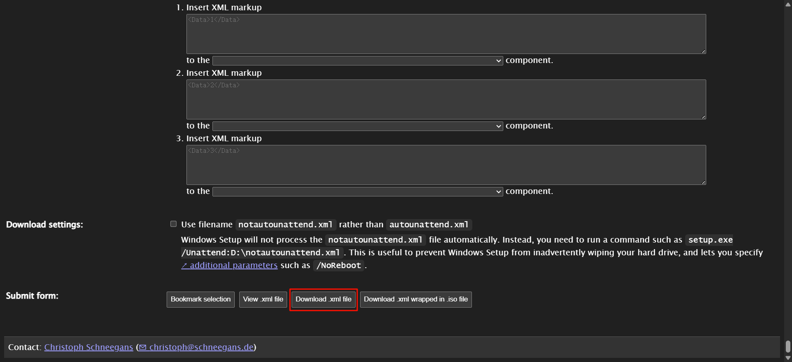

## 前言

`Autounattend.xml` 是 Windows 系统中的一种自动化安装策略文件，用于配置 Windows 安装过程中的各种设置和选项，以实现自动化、无人参与的安装过程。

## 前期准备

1. 下载一个 Windows 系统镜像，推荐使用 Windows 11 IoT Enterprise LTSC 镜像(物联网企业版)。
<RRelatedView id="a996c8c6a989391e5a62976f60e1d414" />
2. 下载 MAS 项目源码。
<RRelatedView id="66304918bb23227f5bbe0f11a52c9648" />
3. 安装系统镜像编辑工具 AnyBurn。
<RRelatedView id="729ef2acbd8afdd7e170d3d2c78243bc" />
4. 下载烧录工具，推荐使用 rufus。
<RRelatedView id="b47c15377482fc1d8213e3085810594d" />

## 开始封装

### 制作应答文件 Autounattend.xml

<RRelatedView id="d2d7d1fb96773451110ffede1bfc88ef" />

勾选 `Use a distribution share / configuration set` 选项。

依据自己的喜好修改其他配置，之后选择 `Download .xml file` 下载 `Autounattend.xml` 文件。

### 准备 `$OEM$` 文件夹

> [!TIP]
> `$OEM$` 文件夹说明：[Distribution Shares and Configuration Sets Overview](https://learn.microsoft.com/en-us/windows-hardware/customize/desktop/wsim/distribution-shares-and-configuration-sets-overview#oem-folders)

#### 使用 MAS 创建 `$OEM$` 文件。

1. 解压 MAS 项目源码。
2. 进入 `MAS/Separate-Files-Version/` 文件夹。
3. 执行命令 `Extract_OEM_Folder.cmd`。
4. 选择 `HWID`。

#### 为镜像添加常用软件的安装包[可选]

> [!TIP]
> 系统安装后，这些安装包会保存至系统盘 `C:/Installs/` 文件夹下。

1. 在 `$OEM$` 文件夹中创建 `$1/Installs/` 文件夹。
2. 将安装包复制到 `$1/Installs/` 文件夹。

<RRelatedView id="89d8d34fcfad16f8faf80144d5179ebe" />

### 编辑系统镜像

1. 打开 AnyBurn 工具，选择 `编辑镜像文件` 打开系统镜像。
2. 将 `Autounattend.xml` 文件复制到镜像根目录下。
3. 将 `$OEM$` 文件夹复制到镜像根目录下。

4. 点击 `下一步` 设置新镜像路径，点击 `开始生成` 按钮，完成镜像编辑。

## 烧录镜像

打开 rufus 工具，选择 `选择镜像文件` 选择刚刚封装好的镜像文件，点击 `开始烧录` 按钮，等待烧录完成。
